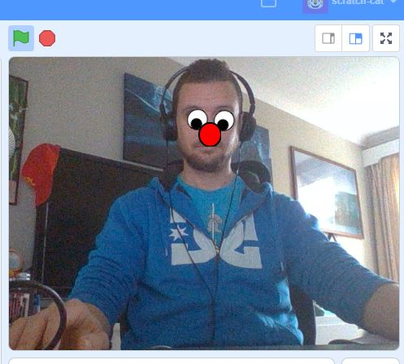

## Introduction

In this project, you will use machine learning to create a snap filter with Scratch! You will use a different version of Scratch (what programmers call a ‘fork’) that is pre-made with special extensions that can access pre-trained machine learning models.

### You will make

--- no-print ---
Use a cloud-based machine learning engine called IBM Watson and Scratch to create a project that will recognise your face in the webcam and place some funny sprites over it to make a mask that follows you!

You will:

+ Use the Scratch **extensions** `Video Sensing`{:class="block3extensions"} and `Face detection`{:class="block3extensions"} to interact with a pre-trained **machine learning model**
+ Use the paint editor to change a **costume**
+ Add new **Sprites** to your project

--- /no-print ---

### Hardware

+ A computer or tablet capable of running Scratch 3
+ A webcam (your tablet or computer may have a webcam already)

### Software

+ This project can only be completed in a web browser using a [version of Scratch 3 available from Machine Learning for Kids](https://machinelearningforkids.co.uk/scratch3/)

