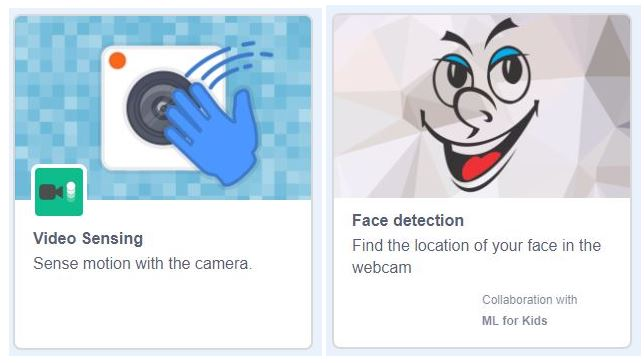
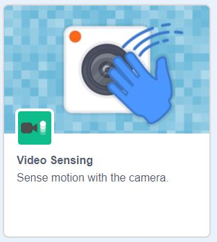
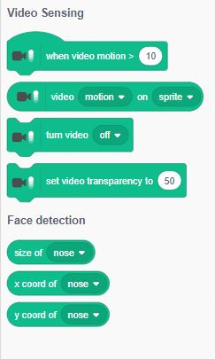
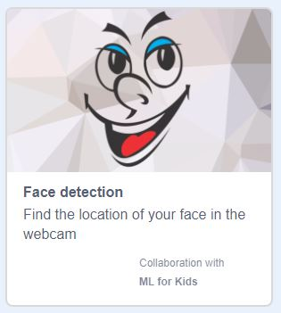

## Facial recognition with Scratch

For this project, you are going to use a special version of Scratch created for facial recognition! You can open this special fork of Scratch any time by following [this link](https://machinelearningforkids.co.uk/scratch3/){:target="_blank"} to make your own machine learning projects.


This version of Scratch is a bit different to the version of Scratch that you are used to, so if you want to save your work, you will need to download your project to your computer and reopen it in this special version of Scratch when you want to use it again.


--- task ---

Open the [special version of Scratch](https://machinelearningforkids.co.uk/scratch3/){:target="_blank"}.
 
--- /task ---

<p style='border-left: solid; border-width:10px; border-color: #0faeb0; background-color: aliceblue; padding: 10px;'>
This project requires a connection to the cloud-based machine learning engine, so you cannot work on this project offline.

You should see the Scratch environment that you are used to, with a couple of small differences. You will notice that there is no **Remix** button and you cannot log in as usual. 

When you want to save your work, you will need to choose **Save to your computer** from the menu and save it locally on the computer you are working on.
</p>

Next, you will add some extensions that are only included in this special fork of Scratch.

### The Scratch editor


--- task ---

The two extensions that you need to enable are `Video Sensing`{:class="block3extensions"} and `Face detection`{:class="block3extensions"}. Add them both now.



--- collapse ---

--- 
title: Adding extensions in Scratch
---

+ Click the **Add Extension** button in the bottom left-hand corner.


+ Click on the **Video Sensing** extension to add it.



+ The `Video Sensing`{:class="block3extensions"} blocks will then appear at the bottom of the Blocks menu.



+ Repeat these steps for the **Face detection** extension.


--- /collapse ---

--- /task ---

Now that you have added the extensions that you need to in Scratch, you should see two new green blocks menus on the left-hand side of your screen. You may have used `Video Sensing`{:class="block3extensions"} or `Face detection`{:class="block3extensions"} extensions before, but don't worry if they are new to you.

These new blocks have been created to access a machine learning model that already exists on the cloud and has been trained to recognise human faces. You will use these blocks to tell Scratch to check with the online model to see where a face appears on your Stage.

--- task ---

First, add a `when green flag clicked`{:class="block3events"} block from the yellow `Events`{:class="block3events"} menu on the left to start your project.


--- /task ---

Next, you need to use `Video Sensing`{:class="block3extensions"} blocks to turn the camera on and set the image to totally opaque when the project starts: 

--- task ---

Add a `turn video on`{:class="block3extensions"} block and a `set video transparency to`{:class="block3extensions"}`0` block.

```blocks3
when gf clicked
+turn video [on v]
+set video transparency to (0)
```

--- /task ---

--- task ---

Click on the green flag to test your work and see the camera come online.  

**Note:** Give your browser permission to use your camera if you are asked.

--- /task ---

Next, you will add the code that will make the mask detect and follow your face!

--- task ---

At the bottom of your script, add a `forever`{:class="block3control"} block from the `Control`{:class="block3control"} blocks menu. 

```blocks3
when gf clicked
turn video [on v]
set video transparency to (0)
+forever
```

--- /task ---

--- task ---

Next, add a `go to x: y:`{:class="block3motion"} block inside your `forever`{:class="block3control"} loop.

```blocks3
when gf clicked
turn video [on v]
set video transparency to (0)
forever
+    go to x:()y:()
```

--- /task ---

--- task ---

Click on the `Face detection`{:class="block3extensions"} blocks menu and select the small rounded `x coord of nose`{:class="block3extensions"} and `y coord of nose`{:class="block3extensions"} blocks and put them into their corresponding spots in the `go to x: y:`{:class="block3motion"} block (make sure that you match x with x and y with y!).

``` blocks3
when gf clicked
turn video [on v]
set video transparency to (0)
forever
+    go to x:(x coord of (nose v)::#0fbd8c)y:(y coord of (nose v)::#0fbd8c)
```

--- /task ---

--- task ---

Click on the green flag and see if your project works.

Your sprite should now follow your face wherever you go!

--- /task ---

In the next step, you will create a silly mask made up of different sprites that will independently cover your nose and eyes!

--- save ---
